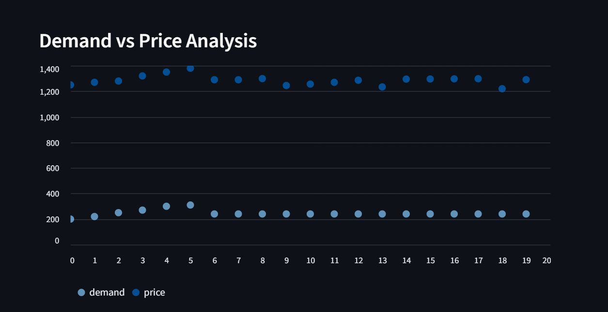
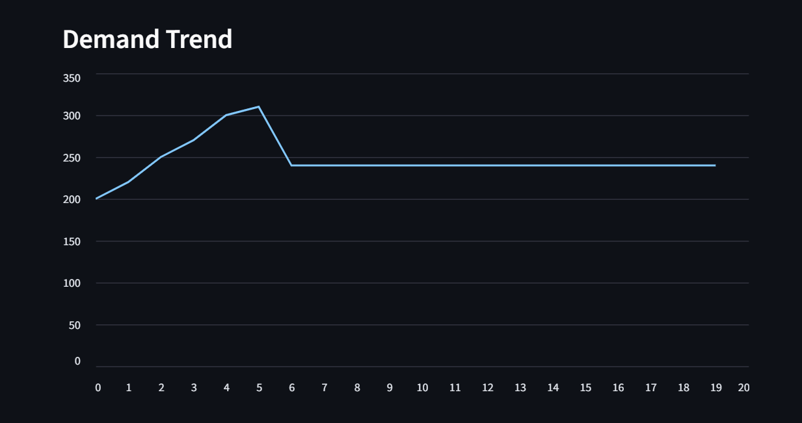
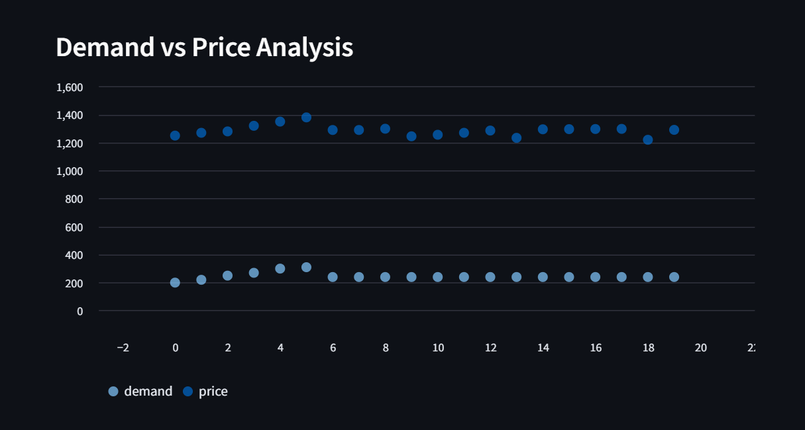
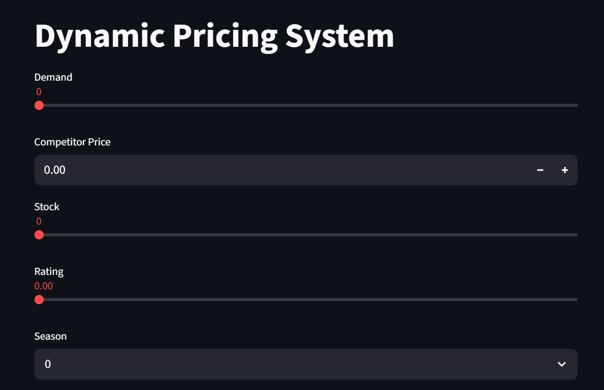
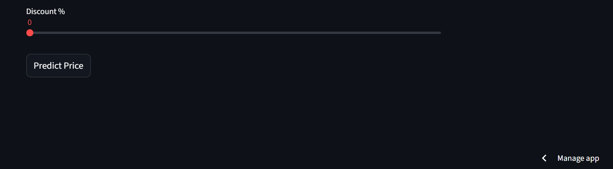

# AI Dynamic Pricing System for E-commerce

This project builds an AI-powered dynamic pricing system that predicts the optimal price of a product based on market conditions.

The system analyzes demand, competitor pricing, stock availability, product rating, seasonality, and discount levels to recommend the best price.

---

## Features

• Machine Learning price prediction model  
• Demand forecasting using Prophet  
• Automatic price optimization logic  
• Interactive dashboard using Streamlit  
• Data visualization for business insights  

---

## Technologies Used

Python  
Streamlit  
Scikit-learn  
Prophet  
Pandas  
NumPy  
Matplotlib  
Seaborn  
Plotly  

---

## Project Structure
# AI Dynamic Pricing System for E-commerce

This project builds an AI-powered dynamic pricing system that predicts the optimal price of a product based on market conditions.

The system analyzes demand, competitor pricing, stock availability, product rating, seasonality, and discount levels to recommend the best price.

---

## Features

• Machine Learning price prediction model  
• Demand forecasting using Prophet  
• Automatic price optimization logic  
• Interactive dashboard using Streamlit  
• Data visualization for business insights  

---

## Technologies Used

Python  
Streamlit  
Scikit-learn  
Prophet  
Pandas  
NumPy  
Matplotlib  
Seaborn  
Plotly  

---

## Project Structure
dynamic-pricing-system
│
├── dataset
│ └── pricing_data.csv

├── model
│ └── pricing_model.pkl

├── train_model.py
├── forecast_demand.py
├── price_optimizer.py
├── app.py

├── requirements.txt
└── README.md

---

## How to Run the Project

### 1 Install dependencies

### 2 Run the Streamlit app

---

## Live Application

You can access the deployed app here:

https://dynamic-pricing-system-kf4whxlwhfqcwfj3liyfov.streamlit.app

---

## Author

Sneha shankarwal 
B.Tech IT (ML & Data Analytics)

---

## Future Improvements

• Real-time competitor price scraping  
• Advanced demand forecasting models  
• Integration with e-commerce APIs  
• Automated pricing optimization engine

## 📸 Application Preview

### Dashboard

### Demand Prediction

### Price Optimization

### Sales Visualization

### Forecast Results

### Model Output

